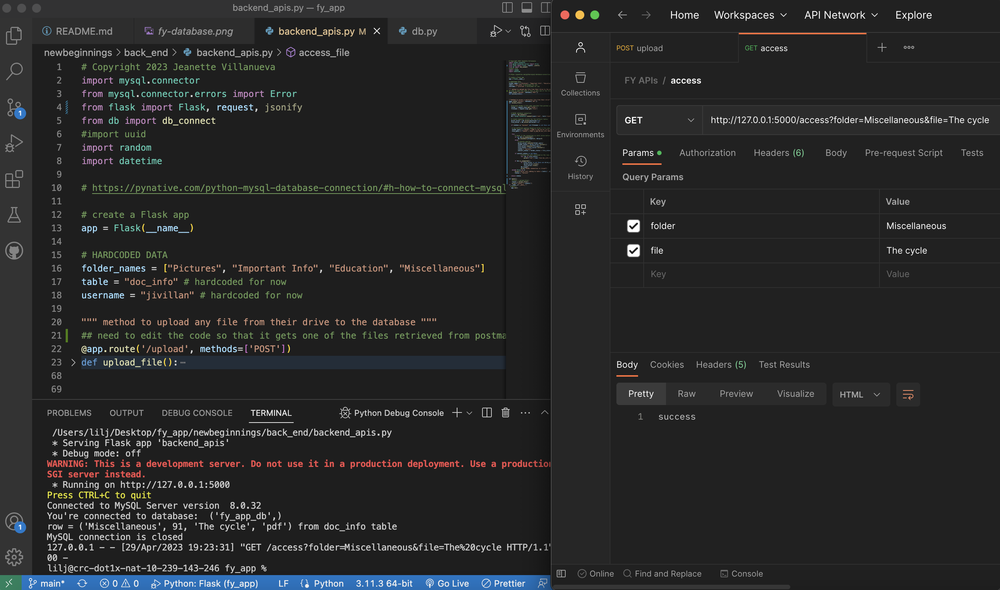
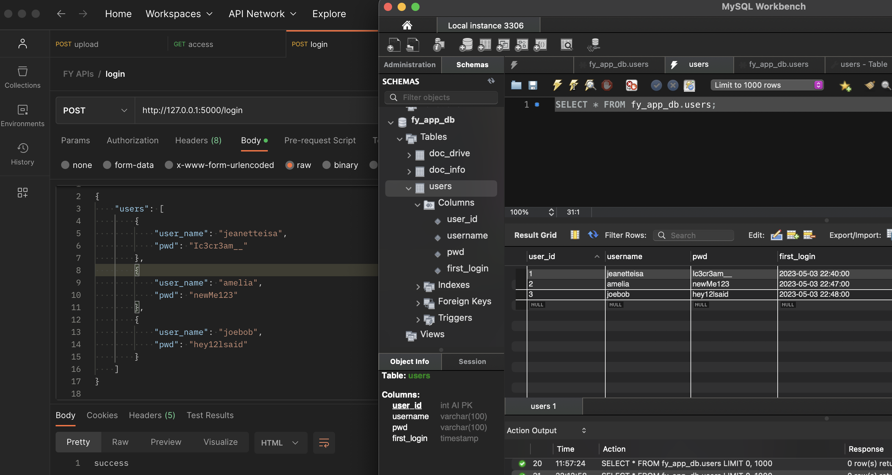

## Project Goals
 1. I should securely login into the app to access my files 
 2. I should be able to access my files caretakers/social workers uploaded 
 3. I should be able to upload any files (PDFs, images)
 4. I want to know all the names, locaitons, instituions and address in my documents. 

## Project Motivation

## Modules 
1. Secure Login 
2. Database
3. Document Drive - upload & access files 
4. NLP
5. Cloud (later implementation)
6. WEB App (initial start, move to mobile eventually)
7. Connect w/ People (stretch goal - means to connect w/ other FY)

## Database Schema
This schema reflects the relationship of how the user can access their drive with all their personal documents.   

## Running Project 
- download mysql from homebrew `brew install mysql`
    - download MySQL Workbench for desktop: [MySQL Workbench](https://dev.mysql.com/downloads/workbench/)
- download Postman for desktop: [Postman](https://www.postman.com/downloads/)
- clone repository: `<> Code --> copy HTTPS url` 
- run in Visual Studio Code by **right clicking in file + Run Python File in terminal**
    - copy url from terminal : ` Running on http://127.0.0.1:5000`
    - paste url into **Postman GET/POST request + endpoint**: `http://127.0.0.1:5000/upload`
- aside : if you want to debug the python file, either `backend_api.py` or `login.py` make sure you specify in `launch.json` file what **app** you're running (i.e. backend_api or login) --> then run the debugger 

## Postman - Testing Apis 

Proof that upload_file() api works!

**Example of success in adding into specified table !**

**Example of success in retrieivng a file from specifed foldername and file - access_file() api works!**

**Example of success in adding users into the database - login() api works !**

