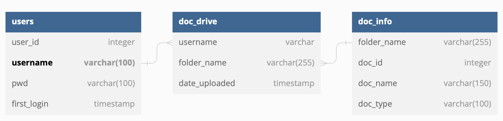
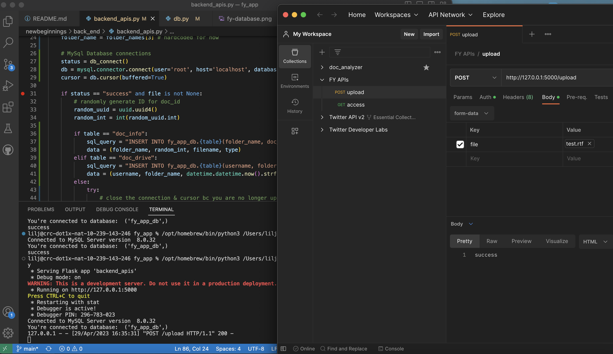

# newbeginnings
personal project for idea I've had for foster youth since I was younger

## Project Goals
 1. I should securely login into the app to access my files 
 2. I should be able to access my files caretakers/social workers uploaded 
 3. I should be able to upload any files (PDFs, images)
 4. I want to know all the names, locaitons, instituions and address in my documents. 

## Project Motivation

## Modules 
1. Secure Login 
2. Database
3. Document Drive - upload & access files 
4. Cloud (later implementation)
5. WEB App (initial start, move to mobile eventually)
6. Connect w/ People (stretch goal - means to connect w/ other FY)

## Database Schema
This schema reflects the relationship of how the user can access their drive with all their personal documents.   

## Postman - Testing Apis 
Proof that one of my apis (upload_file) works!

