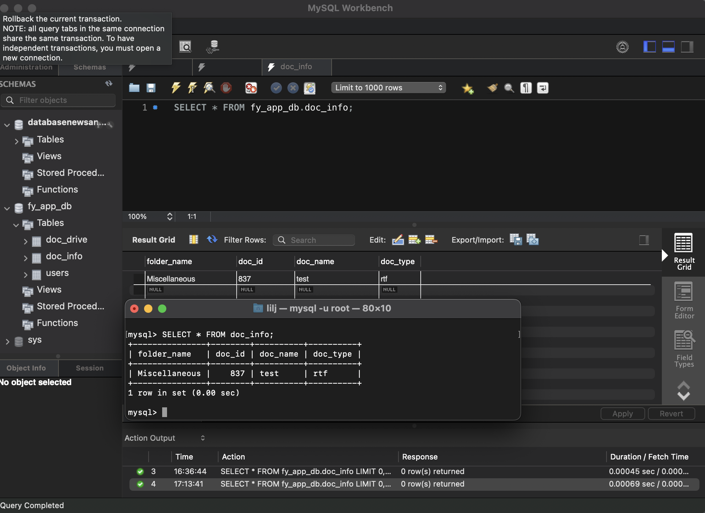

## Project Goal 
This app's target audience are foster youth that have aged out of the system when they are 18 years old & even foster youth who have been happily adopted. They will be able to use this app to access any and all documentation from legal files to mementos like photos. This app serves as one's personal flashback that can be accessed at their finger tips whenever they desire. Lastly, this app serves to maintain the positive memories of the foster youth's life and intends to be living proof that despite the traumatic experiences endured, their identity hasn't been completely erased. 

## Project Motivation
I am eager to complete this project as I have a personal connection/motivation to this project. As a proud adoptee and former youth, I yearned as I grew older to have mementos and access to documentation that reflected the person I was and how I looked when I was younger. Yet, I had little to no evidence of who I was, who I met, and where I had been. The common phrase "take a picture, it lasts longer" is something I've held dear to my heart & I want current foster youth to feel secure in knowing they will not completely lose parts of their identify due to their involuntary placement in the Foster system.  

## Project User Stories 
 1. I should securely login into the app to access my files 
 2. I should be able to access my files caretakers/social workers uploaded 
 3. I should be able to upload any files (PDFs, images)
 4. I want to know all the names, locaitons, instituions and address in my documents. 
 
 
## Modules 
1. Secure Login 
2. Database
3. Document Drive - upload & access files 
4. NLP
5. Cloud (later implementation)
6. WEB App (initial start, move to mobile eventually)
7. Connect w/ People (stretch goal - means to connect w/ other FY)

## Database Schema
This schema reflects the relationship of how the user can access their drive with all their personal documents.   

## Running Project 
- download mysql from homebrew `brew install mysql`
    - download MySQL Workbench for desktop: [MySQL Workbench](https://dev.mysql.com/downloads/workbench/)
- download Postman for desktop: [Postman](https://www.postman.com/downloads/)
- clone repository: `<> Code --> copy HTTPS url` 
- run in Visual Studio Code by **right clicking in file + Run Python File in terminal**
    - copy url from terminal : ` Running on http://127.0.0.1:5000`
    - paste url into **Postman GET/POST request + endpoint**: `http://127.0.0.1:5000/upload`
- aside : if you want to debug the python file, either `backend_api.py` or `login.py` make sure you specify in `launch.json` file what **app**  you're running (i.e. backend_api or login) --> then run the debugger 

## Postman - Testing Apis 

Proof that upload_file() api works!

**Example of success in adding into specified table !**

**Example of success in retrieivng a file from specifed foldername and file - access_file() api works!**

**Example of success in adding users into the database - login() api works !**

